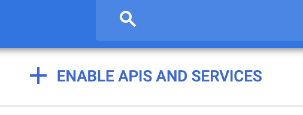
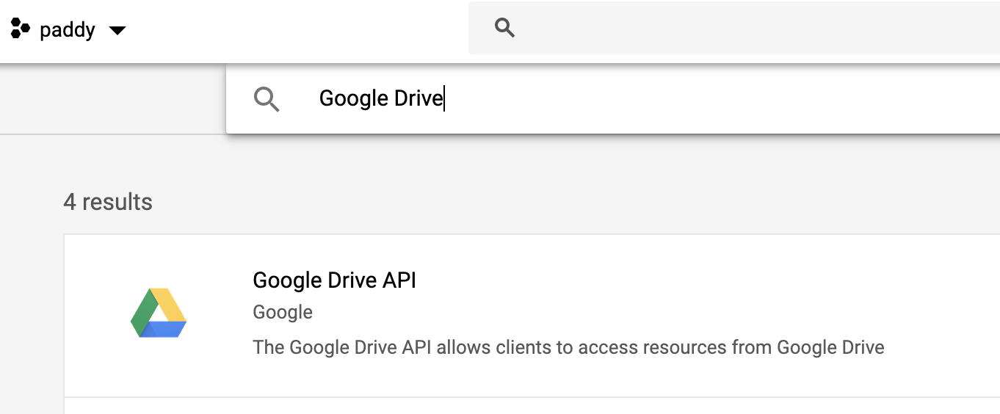
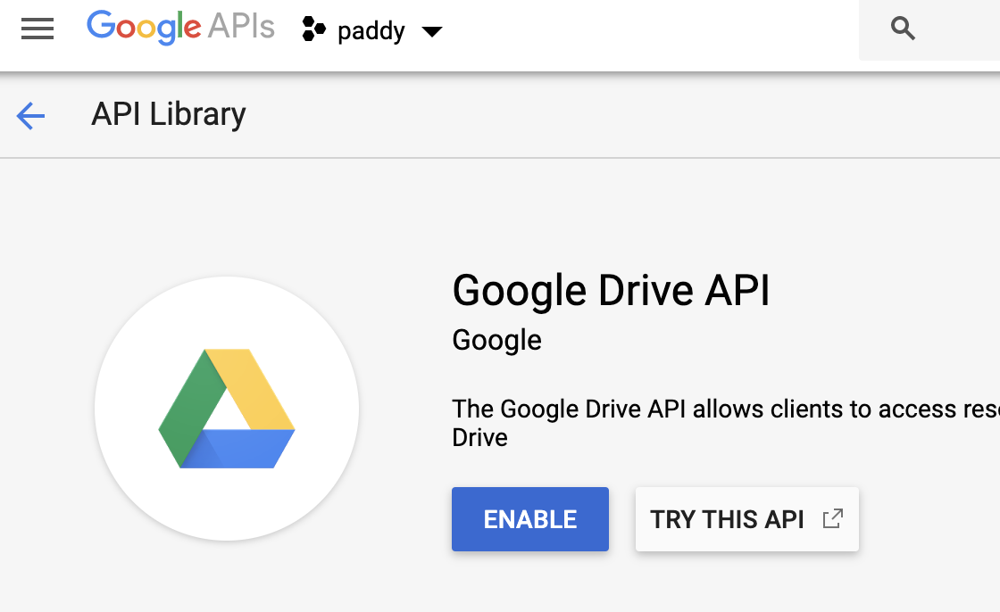
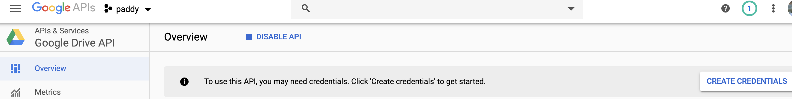
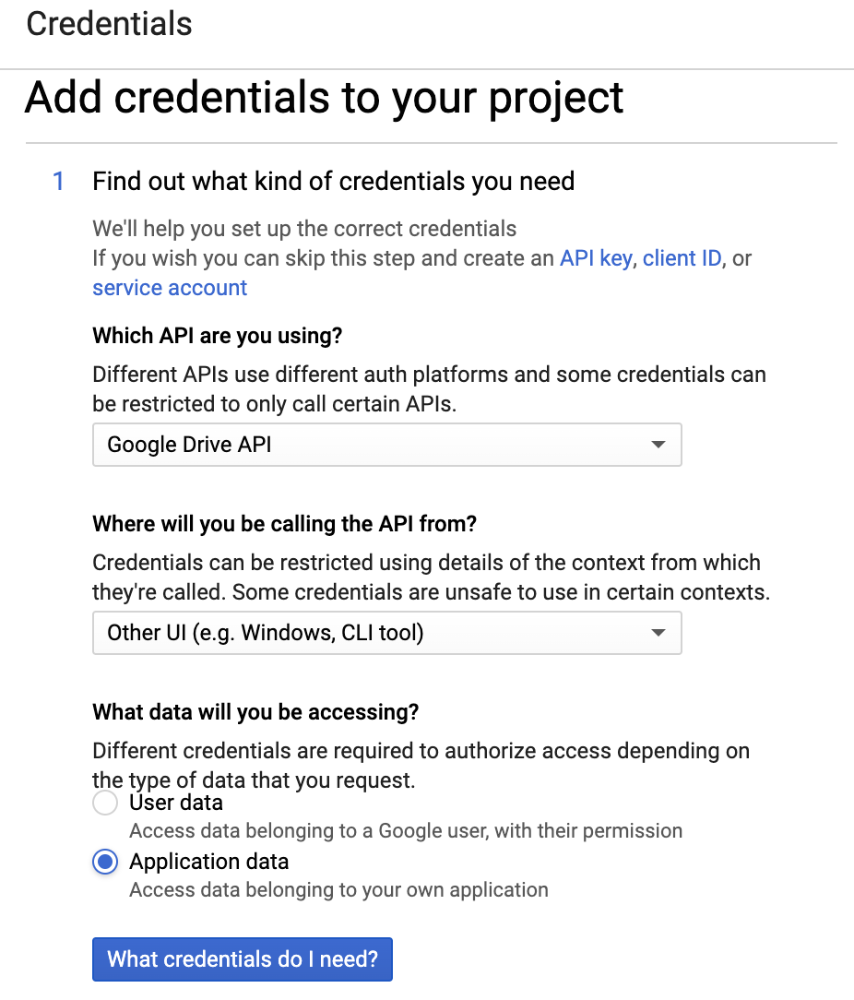
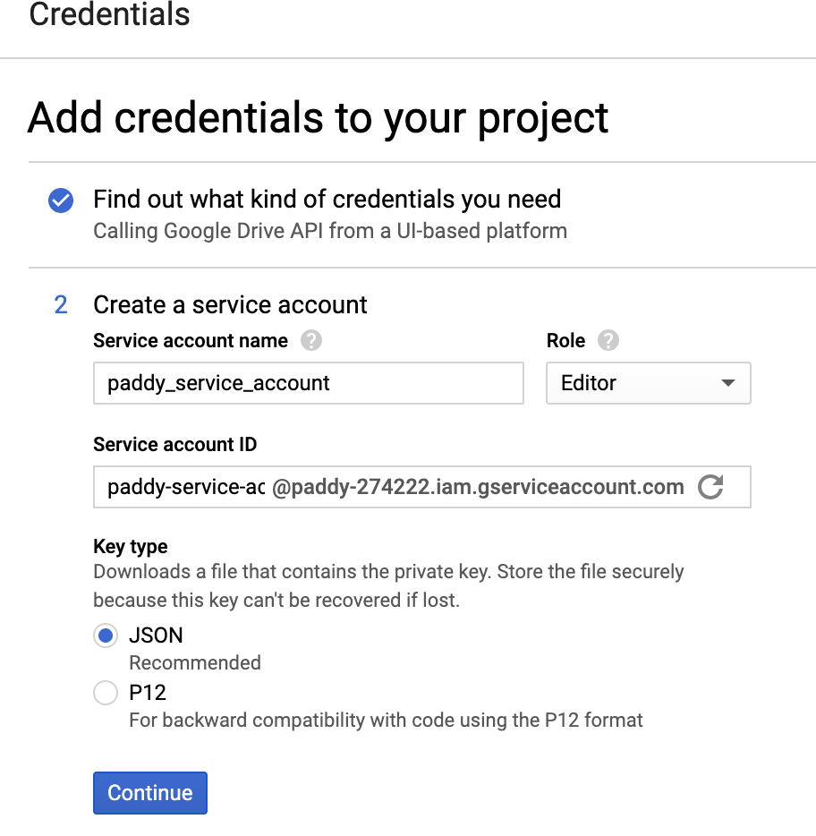

# dairy-spread 

Often it is useful to have bioinformatics data in a spreadsheet, 
where the data can be better visualized and annotated manually. 
To integrate this approach into a data-analysis pipeline, 
it is useful to be able to programatically edit the spreadsheet. 

dairy-spread allows you to create a google spreadsheet at the command line from a vcf, and to delete a spreadsheet so created, 
also from the command line.
Each record in the spreadsheet contains a hyperlink representing the location of a variant, 
and additional columns representing user-defined parts of the vcf record, e.g., INFO.AC. 
The link can be used to visually inspect the variant in igv.js,
while the spreadsheet can be used to record any conclusions drawn from the manual inspection of the igv visualization. 
This can be useful during the development of variant-calling software, 
when one often needs to inspect cases where (i) the software is not capturing variants that are known to exist, 
and/or (ii) the software is making calls where variants are known to be absent. 

## How to get dairy-spread working

1. [Obtain credentials for the Google Drive API](#obtain-credentials-for-the-google-drive-api)
2. Install dependencies 
3. Run the tool at the command line 

## Obtain credentials for the Google Drive API 

Create a project at https://console.cloud.google.com/ Here I've created one called "paddy": 

Click "Go to API overview": 

Click "ENABLE APIS AND SERVICES": 

In the search box that appears, type "Google Drive": 

Click "ENABLE": 

Click "CREATE CREDENTIALS": 

Select the options indicated below: 

and click "What credentials do I need". On the next screen, select "Project Editor" in the "Role" dropdown
and fill in the "Service account name" as indicated: 

Clicking "Continue" will download a json file that should be renamed to `credentials.json` and moved to this folder. 

For security, run `chmod og-r credentials.json`. 

Navigate back to https://console.cloud.google.com/ and click "ENABLE APIS AND SERVICES" again to enable the Google Sheets API. 

Wait at least 15 minutes for the requests to enable the two APIs to propagate to google's systems. 

## Install dependencies 

